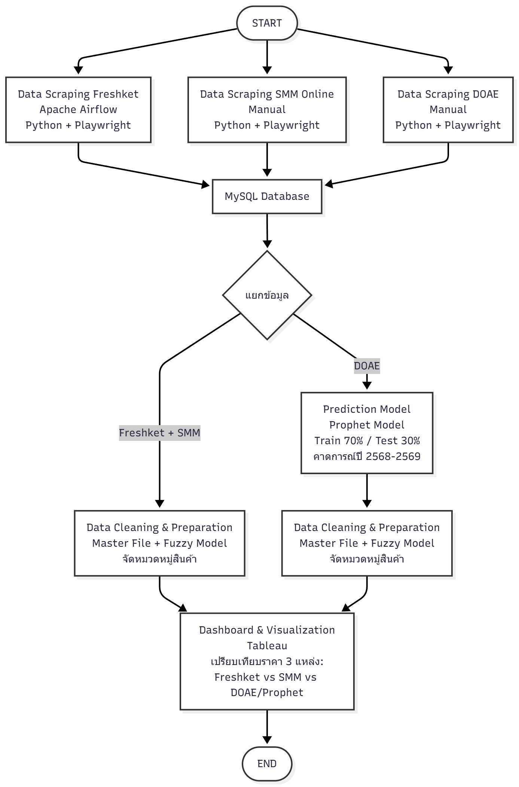

# 🥬 ระบบวิเคราะห์และคาดการณ์ราคาสินค้าเกษตร (Agricultural Data Pipeline & Prediction)

**📌 หมายเหตุ (Disclaimer):** *โปรเจกต์นี้เป็นส่วนหนึ่งของการฝึกประสบการณ์วิชาชีพ (Data Engineering Internship) เพื่อเป็นการเคารพสิทธิ์และรักษาความลับทางธุรกิจ (Confidentiality) Repository นี้จึงจัดทำขึ้นเพื่อแสดง **สถาปัตยกรรมระบบ (System Architecture)** และกระบวนการพัฒนา Data Pipeline เท่านั้น โดยไม่เปิดเผยซอร์สโค้ดฉบับเต็ม*

📥 **[คลิกเพื่ออ่านเอกสารโปรเจกต์ (PDF)](https://github.com/krittrin09/-/blob/main/ระบบวิเคราะห์และคาดการณ์ราคาผัก-กฤตตฤน.pdf)** 

---

## 🏗️ สถาปัตยกรรมระบบ (Data Pipeline Architecture)

### 🛤️ กระบวนการไหลของข้อมูล (Data Flow)
โปรเจกต์นี้ถูกออกแบบมาเพื่อพัฒนาระบบรวบรวมข้อมูลราคาผลผลิตทางการเกษตรจากแหล่งข้อมูลสาธารณะ (Public Data Sources) นำมาจัดระเบียบและสร้างโมเดลทำนายแนวโน้ม โดยแบ่งการทำงานออกเป็น 4 ส่วนหลัก ดังนี้:

**1. การรวบรวมข้อมูล (Data Extraction):**
* พัฒนาสคริปต์ Web Scraping ด้วย **Python (Playwright)** เพื่อรวบรวมข้อมูลราคาผักจากแพลตฟอร์มตลาดสินค้าเกษตรออนไลน์และหน่วยงานรัฐ (DOAE)
* ควบคุมการทำงานอัตโนมัติ (Orchestration) ผ่าน **Apache Airflow**

**2. การจัดเก็บข้อมูล (Data Storage):**
* ข้อมูลดิบที่ถูกดึงมาจะถูกส่งไปจัดเก็บรวมกันที่ฐานข้อมูล **MySQL Database** อย่างเป็นระบบ

**3. การทำความสะอาดและประมวลผล (Data Processing & Modeling):**
* **Data Cleaning:** ข้อมูลจากแพลตฟอร์มออนไลน์จะถูกนำมาผ่านกระบวนการทำความสะอาด โดยประยุกต์ใช้ **Fuzzy Logic Model** เพื่อช่วยจัดหมวดหมู่และปรับมาตรฐานชื่อสินค้าที่เขียนต่างกันให้ตรงกับ Master File
* **Machine Learning:** นำข้อมูลสถิติราคาจากหน่วยงานรัฐ ไปสร้างโมเดลพยากรณ์ด้วย **Prophet Model** (แบ่งข้อมูล Train 70% / Test 30%) เพื่อคาดการณ์แนวโน้มราคาล่วงหน้า (ปี 2568-2569) ก่อนนำไปจัดหมวดหมู่ด้วย Fuzzy Model

**4. การแสดงผล (Dashboard & Visualization):**
* นำข้อมูลที่ผ่านกระบวนการทั้งหมดมาสร้าง Interactive Dashboard ด้วย **Tableau**
* เพื่อใช้ในการแสดงผลเปรียบเทียบโครงสร้างราคาจากหลายแหล่งข้อมูล ช่วยสนับสนุนการวิเคราะห์แนวโน้มตลาดสินค้าเกษตร

---

## 🛠️ เครื่องมือที่ใช้ (Tech Stack)
## 🛠️ เครื่องมือที่ใช้ (Tech Stack)

**Data Extraction:**  

**Orchestration:** 

**Database:** 

**Data Processing & ML:**  
 

**Data Visualization:** 

**IDE & Environments:** 
